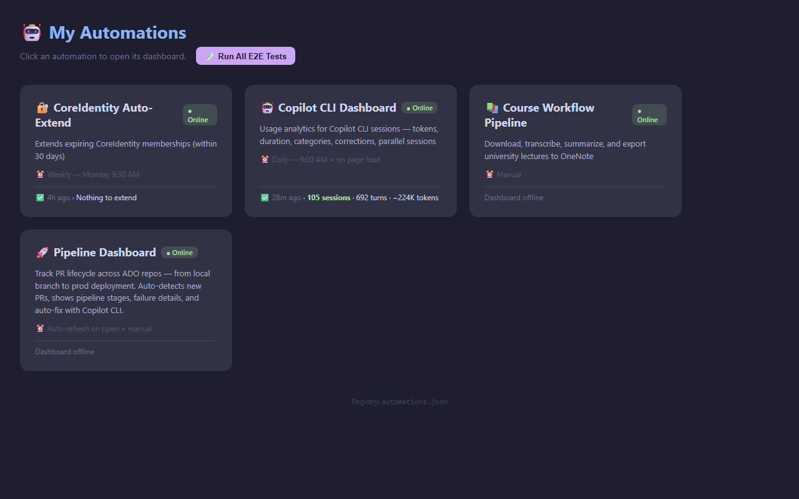
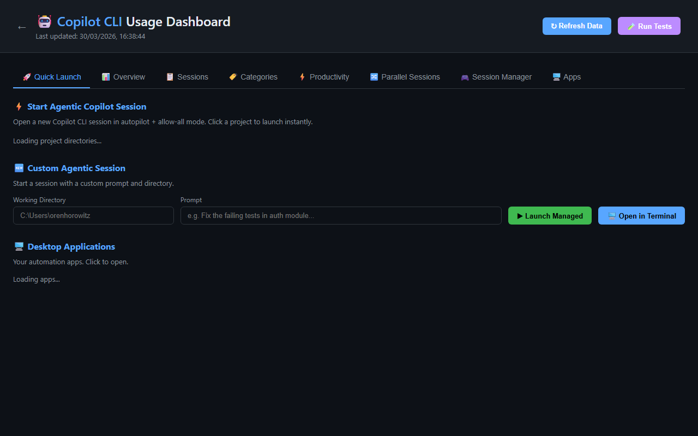
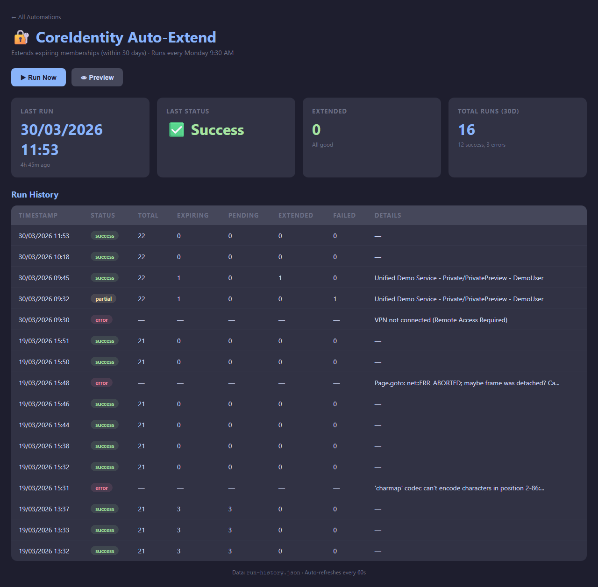
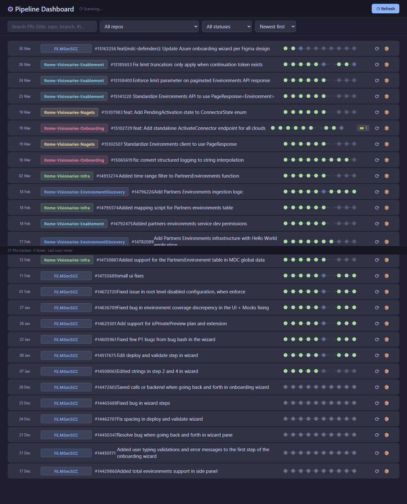

# 🤖 Desktop Automations

A collection of local desktop automation tools for Microsoft employees. Each tool runs as a lightweight Python HTTP server with a browser-based dashboard.

> **Owner**: [orenMicrosoft](https://github.com/orenMicrosoft) · Contributions welcome via PR (approved by owner only)

---

## What's Included

| Automation | Description | Schedule |
|---|---|---|
| [**Copilot CLI Dashboard**](copilot-dashboard/) | Usage analytics for GitHub Copilot CLI — sessions, tokens, categories, corrections, parallel session detection | Daily 9 AM + on page load |
| [**CoreIdentity Auto-Extend**](coreidentity-autoextend/) | Automatically extends expiring CoreIdentity memberships before they lapse | Weekly — Monday 9:30 AM |
| [**Pipeline Dashboard**](pipeline-dashboard/) | Tracks PR lifecycle across Azure DevOps repos — from local branch to prod deployment | Auto-refresh + manual |
| [**Automation Hub**](hub/) | Central launcher that starts/monitors all automation dashboards from one page | On demand |

---

## Screenshots

### Automation Hub
The central launcher — click any card to start its dashboard server and open it.



### Copilot CLI Dashboard
Session analytics: usage over time, category breakdown, correction rate, parallel sessions, and a built-in session manager with live SSE streaming.



### CoreIdentity Auto-Extend
Run history, success rates, and one-click manual trigger with dry-run preview.



### Pipeline Dashboard
PR lifecycle tracker: see every stage from branch creation through prod deployment, with failure details and auto-refresh.



---

## Quick Start

### Prerequisites

- **Python 3.11+** with pip
- **Playwright** (for CoreIdentity): `pip install playwright && python -m playwright install chromium`
- **Azure CLI** (for Pipeline Dashboard): `az login`
- **Microsoft Edge** (for corporate SSO in CoreIdentity)
- **MSFT-AzVPN-Manual** VPN connection (for CoreIdentity)
- **GitHub Copilot CLI** installed (for Copilot Dashboard data collection)

### Installation

```powershell
# Clone the repo
git clone https://github.com/orenMicrosoft/desktop-automations.git
cd desktop-automations

# Install Python dependencies
pip install playwright   # Only needed for CoreIdentity

# Set up your configuration (see each automation's section below)
```

### Run Everything via the Hub

```powershell
cd hub
python hub_server.py
# Opens http://localhost:8091 — click any card to launch its dashboard
```

### Run Individual Automations

```powershell
# Copilot CLI Dashboard
cd copilot-dashboard
python launch.py                    # Serves at http://localhost:8787

# CoreIdentity Auto-Extend
cd coreidentity-autoextend
python renew_entitlements.py --dry-run   # Preview what would be extended
python dashboard_server.py               # Dashboard at http://localhost:8090

# Pipeline Dashboard
cd pipeline-dashboard
cp pipeline_data.example.json pipeline_data.json  # Edit with your config
python pipeline_dashboard.py             # Dashboard at http://localhost:8093
```

---

## Configuration

### Copilot CLI Dashboard
No configuration needed — it reads from `~/.copilot/session-store.db` (created automatically by Copilot CLI).

To set up automatic daily data refresh:
```powershell
cd copilot-dashboard
powershell -ExecutionPolicy Bypass -File setup-scheduled-task.ps1
```

### CoreIdentity Auto-Extend
Environment variables (optional):
| Variable | Default | Description |
|---|---|---|
| `CI_JUSTIFICATION` | `"Active team member — auto-extend"` | Justification text for extension requests |

CLI flags:
```powershell
python renew_entitlements.py --threshold 14    # Extend if expiring within 14 days (default: 30)
python renew_entitlements.py --dry-run          # Preview only
python renew_entitlements.py --discover         # Debug: show page structure
python renew_entitlements.py --no-autofix       # Disable Copilot CLI auto-diagnosis on failure
```

Set up the weekly scheduled task:
```powershell
$Action = New-ScheduledTaskAction -Execute (Get-Command python).Source `
    -Argument "`"$PWD\renew_entitlements.py`"" -WorkingDirectory $PWD
$Trigger = New-ScheduledTaskTrigger -Weekly -DaysOfWeek Monday -At "09:30"
$Settings = New-ScheduledTaskSettingsSet -AllowStartIfOnBatteries -StartWhenAvailable
Register-ScheduledTask -TaskName "CoreIdentity-AutoExtend" `
    -Action $Action -Trigger $Trigger -Settings $Settings `
    -Description "Weekly CoreIdentity entitlement auto-extension"
```

### Pipeline Dashboard
1. Copy the example config:
   ```powershell
   cp pipeline_data.example.json pipeline_data.json
   ```
2. Edit `pipeline_data.json` with your details:
   - `creator_email`: Your Microsoft email
   - `ado_org`: Your ADO organization URL (e.g., `https://dev.azure.com/msazure`)
   - `ado_project`: Your ADO project name
   - `repos`: Map of repo names to their ADO repository GUIDs

   Find repo GUIDs via: `az repos list --org <org> --project <project> --query "[].{name:name, id:id}" -o table`

---

## How to Consume

1. **Clone** this repo to your local machine
2. **Configure** each automation you want to use (see Configuration above)
3. **Run** via the hub (`python hub/hub_server.py`) or individually
4. **Schedule** automations that support it (CoreIdentity, Copilot data refresh)

Each automation is self-contained in its own directory — you can use any subset.

---

## How to Contribute

### Contribution Model
- This repo is **publicly visible** but contributions require **PR approval from the owner**
- All PRs must be reviewed and approved before merging
- Direct pushes to `main` are not allowed (except by the owner)

### Adding a New Automation

1. **Create a new directory** at the repo root (e.g., `my-new-automation/`)
2. **Follow the standard pattern**:
   - `dashboard_server.py` or similar — HTTP server serving the dashboard
   - `dashboard.html` — Browser-based UI
   - `e2e_tests.py` — End-to-end tests
   - `README.md` — Documentation
3. **Register it** in `hub/automations.json`:
   ```json
   {
     "id": "my-new-automation",
     "name": "My New Automation",
     "description": "What it does",
     "schedule": "Manual",
     "dashboard": "http://localhost:PORT/dashboard.html",
     "port": PORT,
     "folder": "my-new-automation",
     "cmd": ["dashboard_server.py"],
     "health_path": "/dashboard.html"
   }
   ```
4. **Submit a PR** with your changes

### Modifying an Existing Automation
1. Fork or branch from `main`
2. Make your changes
3. Run the automation's E2E tests if available
4. Submit a PR

### Code Guidelines
- **No hardcoded user paths** — use relative paths, `os.path.expanduser("~")`, or environment variables
- **No secrets in code** — use environment variables or config files (gitignored)
- **Self-contained directories** — each automation should work independently
- **Dashboard pattern** — Python HTTP server + HTML dashboard + optional scheduled task

---

## Architecture

```
desktop-automations/
├── hub/                         # Central launcher (port 8091)
│   ├── hub_server.py            # Hub HTTP server
│   ├── automations.json         # Registry of all automations
│   ├── index.html               # Hub UI
│   └── open-dashboard.bat       # Windows shortcut
├── copilot-dashboard/           # Copilot CLI analytics (port 8787)
│   ├── launch.py                # Dashboard server + APIs
│   ├── collect_data.py          # Data collector from session-store.db
│   ├── session_manager.py       # Managed Copilot subprocess sessions
│   ├── dashboard.html           # Dashboard UI
│   ├── setup-scheduled-task.ps1 # Scheduled task installer
│   ├── CopilotDashboard.vbs     # Hidden launcher (no console)
│   ├── e2e_tests.py             # E2E tests
│   └── tests/
│       └── test_launch_flags.py # Unit tests
├── coreidentity-autoextend/     # CoreIdentity renewal (port 8090)
│   ├── renew_entitlements.py    # Main automation script
│   ├── dashboard_server.py      # Dashboard server
│   ├── dashboard.html           # Dashboard UI
│   ├── test_renew_entitlements.py # Unit tests
│   └── README.md                # Detailed docs
├── pipeline-dashboard/          # ADO PR tracker (port 8093)
│   ├── pipeline_dashboard.py    # Dashboard server
│   ├── ado_client.py            # ADO REST API client
│   ├── dashboard.html           # Dashboard UI
│   ├── pipeline_data.example.json # Config template
│   └── e2e_tests.py             # E2E tests
└── docs/
    └── screenshots/             # Dashboard screenshots
```

---

## License

Internal use — Microsoft employees only.
Desktop automation tools for Microsoft employees — Copilot CLI Dashboard, CoreIdentity Auto-Extend, Pipeline Dashboard, and Automation Hub
